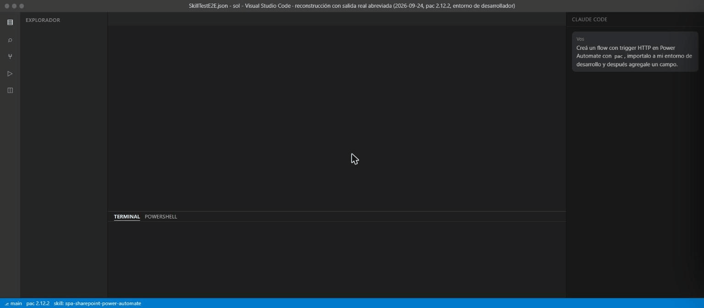
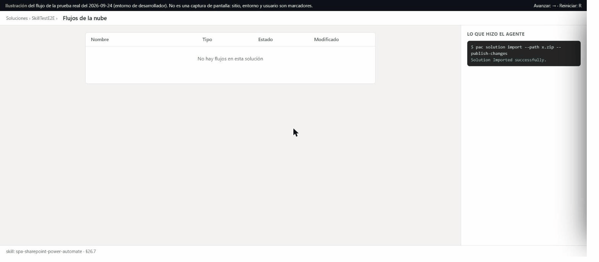
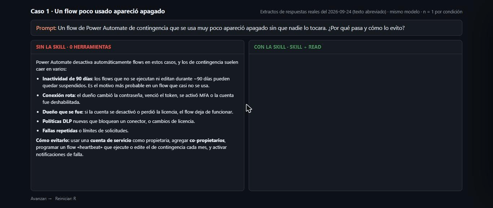

# power-automate-sharepoint-skills

[](https://github.com/apu242007/power-automate-sharepoint-skills/actions/workflows/validate.yml)
[](LICENSE)
[](https://agentskills.io/specification)

**Let your AI agent build the web page, the Power Automate flow and the SharePoint list, from your own computer, and know why it breaks.**

An agent skill for Claude Code, GitHub Copilot in VS Code, Codex, Cursor and any agent that reads the [Agent Skills](https://agentskills.io/specification) format. It teaches the agent how to connect an **external web page** (React/Vite or a static PWA) to **SharePoint through Power Automate**, how to create and change those flows **as code from your terminal** with the Power Platform CLI (`pac`) instead of editing them by hand in the portal, and the traps that only show up at runtime: limits, licensing, tenant policies, exact symptom, cause and fix, with the platform facts checked against Microsoft Learn (with date and link).

> 🇪🇸 [Leer en español](README.es.md) · The skill body is written mostly in **Spanish**; the key platform sections (§21–§23, §26, §29, §30, §32) are **translated to English** in `references/en/`.



*Reconstruction of the real test run of 2026-09-24 (`pac` 2.12.2, developer environment): the commands and outputs are real but abbreviated, and the environment, user and trigger URL are replaced by placeholders. It is not a screen recording. The last card shows what the agent could **not** do on its own.*



*Illustration of the flow from the same test run, drawn generically (site and environment are placeholders). It is **not** a screenshot of the portal.*



*Excerpts of real answers from the same model, without the skill (left) and with it (right); highlighted text is what the answer without the skill was missing. n = 1 per condition, abbreviated text.*

## What it does, and what it does not

The skill is **knowledge the agent reads**. It does not connect to anything by itself and it does not sign you in. The work is done by your agent with its own tools (terminal, `pac`, file editing), and the skill tells it the supported way to do it and what goes wrong.

**Typical use.** You ask your agent, in VS Code or in a terminal:

> "Build a public page that sends a form to SharePoint through a Power Automate flow. Create the flow as code with `pac`, import it into my dev environment and give me the page."

With the skill loaded, the agent knows the pipeline (page → HTTP-trigger flow → SharePoint list), the supported CLI path for the flow, the trigger authentication default that returns 401, the limits, and what to ask IT for when policies get in the way.

### What has been tested with a real agent run

Tested on 2026-09-24 with `pac` 2.12.2 in a **developer environment** (not production), writing to a test SharePoint list. Details and traps in §26.7.

| Step | Status |
|---|---|
| Sign in from the terminal with `pac auth create --deviceCode` | Tested |
| Create a solution project and an HTTP-trigger flow **as code**, `pack` and `import` | Tested |
| Flow turned on after import, without opening the designer | Tested (a flow with no connections) |
| POST from outside to the trigger URL; run history read with `pac power-automate list-flow-runs` | Tested |
| Change the flow in code (new field), reimport, new definition live | Tested |
| SharePoint connection reference in the solution + deployment settings file, import | Import tested |
| Create a SharePoint list and column from code (a scheduled flow with REST calls) | Tested |
| A flow with a SharePoint action **writes a row** (the outside POST returned the row `Id`) | Tested |
| Get the trigger URL from code | **Not possible with `pac`**: copy it from the designer |
| Create the SharePoint connection from code | Not covered: the tested run created it in the portal, and the flows had to be opened, turned on and run there after import (which step was needed was not confirmed) |
| Build Power Apps canvas apps | Not covered (Power Apps appears only as a caller of the flow) |

You still need: `pac` installed and signed in to an environment you may change, a Premium license where the HTTP trigger requires it, and permission on the SharePoint site. Check `pac auth who` before every import so you do not touch the wrong environment.

## Quick start (3 steps)

1. **Install the skill** (needs Node.js): `npx skills add https://github.com/apu242007/power-automate-sharepoint-skills --skill spa-sharepoint-power-automate`
2. **Sign in to a development environment** with the Power Platform CLI: `pac auth create --name Dev --environment "<url>" --deviceCode`, then check `pac auth who`.
3. **Ask your agent** for what you need, for example: *"Using the spa-sharepoint-power-automate skill, create an HTTP-trigger flow as code that writes to my test list, import it, and show me how to call it."*

## Who it is for

- **Makers and citizen developers** who build web forms or field apps on SharePoint and want an AI agent to do the repetitive work.
- **Developers** who prefer VS Code and a terminal to the flow designer, and want flows in Git.
- **IT-constrained teams** that need to know what to ask their administrators for (DLP, licensing, `Sites.Selected`).

## The problem it solves

You build a public, no-login web form (React/Vite or a static PWA on GitHub Pages) that POSTs to a **Power Automate HTTP-trigger flow** that writes to **SharePoint**. It works on your machine. Then:

- the new flow returns **401** to the browser and the run history is empty,
- the run is green but the **attachments are missing**,
- `Get items` returns **100 rows**, or nothing at all past **5,000**,
- the flow **stops on its own**, or fails with `DirectApiAuthorizationRequired`,
- it works on mobile data and fails on the **corporate network**,
- `Get file content` says `Route did not match` with a perfectly good path.

A strong agent often gets the headline cause on its own. What it usually lacks is the second-order detail: the exemptions, the exact numbers, the caveats and the "do not do this" warnings, each with a source. In an 8-symptom comparison the skill's answers covered all 44 verified facts against 25 without it (small sample, biased by construction: see [`evals/comparison.md`](evals/comparison.md)).

## What you get

| | |
|---|---|
| **34 sections in 22 reference files**, routed from a light index | You only load what the task needs |
| **78 error-catalog rows** | Symptom → cause → fix, for runtime traps, not just documentation |
| **Platform limits and licensing, with sources and dates** | Trigger auth default, Premium, 120 s / 100 MB, thresholds, throttling, auto-suspension, DLP |
| **Flows as code, two ways** | The **supported** path (PAC CLI + Dataverse `workflow` table, with a recipe tested in a real run) and the unsupported package + admin API path (dev only) |
| **Design guidance** | Public-endpoint security, list design and indexes, resilience (try/catch, idempotent retries), personal data |
| **A tested starter kit** (`assets/spa-starter/`) | SPA with signature, photos, versioned draft, service worker and a send client with idempotent retries; 117 tests |
| **29 static evals + CI** | Official validator, structure, privacy scan and link check on every push |

## Try it: questions the skill is built for

| Ask your agent | It should route to |
|---|---|
| "Create an HTTP flow from scratch with `pac` and import it" | §26.7: the tested recipe, with the traps observed and what was **not** tested |
| "My SPA gets 401 from the flow I just created" | §21.1: the default of *Who can trigger the flow* is **Any user in my tenant**, not *Anyone* |
| "The run is green but attachments are missing" | §22.1: an early `Response` plus a handled failure; end the Catch with `Terminate → Failed` |
| "`Get items` returns only 100 rows / empty on a big list" | §23: Top Count, Pagination, indexed columns, the 5,000 threshold |
| "It works on mobile data but not from the office network" | §29.4: domains IT must allow (`*.logic.azure.com`, `*.api.powerplatform.com`) |
| "How do I export, edit and re-import a solution flow from the CLI?" | §26: `pac solution export / unpack / pack / import`, deployment settings file |
| "A flow I did not touch turned itself off" | §21.3: 90 days without activity, 14 days of failures, and the exemption for Premium owners or Process licenses |
| "IT will not give me tenant-wide permissions" | §32: `Sites.Selected` and a one-paragraph request IT can approve |
| "`Route did not match` on *Get file content*" | §28.2: pass the trigger's `{Identifier}`, not a hand-built path |

## Install

```bash
# any agent supported by the skills CLI (Claude Code, Codex, Copilot, Cursor, Gemini CLI, Cline, ...)
npx skills add https://github.com/apu242007/power-automate-sharepoint-skills --skill spa-sharepoint-power-automate
```

```text
# Claude Code plugin marketplace
/plugin marketplace add apu242007/power-automate-sharepoint-skills
/plugin install spa-sharepoint-power-automate@power-automate-sharepoint-skills
```

Or copy `skills/spa-sharepoint-power-automate/` into your agent's skills folder. Open a new session so the agent loads it, and **read any skill before installing it**: it runs with your agent's permissions.

To follow the tested recipe you also need the [Power Platform CLI](https://learn.microsoft.com/power-platform/developer/cli/introduction) (`pac`), signed in to a development environment.

## How the content is organised

`SKILL.md` is a light index (router from symptom to file, plus 16 non-negotiable rules). The detail lives in `references/`:

| § | Topic | File |
|---|---|---|
| 1 | Security model of a public endpoint | `01-seguridad.md` |
| 2–7 | SPA: Vite/Pages, React, forms, images/GPS/signature/PDF, persistence, service worker | `02-spa-cliente.md` |
| 8–9 | SPA ↔ flow contract; building the flow | `03-contrato-y-flow.md` |
| 10, 18 | SharePoint over REST; bulk Excel → SharePoint sync | `04-sharepoint.md` |
| 11–12 | GitHub Pages; credentials and device code | `05-deploy-y-credenciales.md` |
| 13–17 | Operations, diagnosis, build order, **error catalog** | `06-operacion-y-errores.md` |
| 19 | Field PWAs (Wake Lock, Web Push, state machine) | `07-pwa-operativa.md` |
| 20 | Flows as code: package, admin API, runtime traps | `08-flows-como-codigo.md` |
| 21 | Trigger auth, licensing, limits, auto-suspension | `09-licencias-limites-trigger.md` |
| 22 | Resilience: try/catch, retries, concurrency, sensitive data | `10-resiliencia-y-errores-flow.md` |
| 23 | SharePoint at scale: thresholds, pagination, throttling | `11-lecturas-sharepoint-a-escala.md` |
| 24 | Solutions, connection references, environment variables, auditing | `12-alm-soluciones-y-auditoria.md` |
| 25 | Third-party tools evaluated, ecosystem survey | `13-decisiones-de-herramientas.md` |
| 26 | Solution flows by code: PAC CLI, Dataverse, **tested recipe (§26.7)** | `14-soluciones-por-codigo-pac-dataverse.md` |
| 27 | SharePoint list design as a backend | `15-diseno-listas-sharepoint.md` |
| 28 | Flows triggered by a file upload | `16-flujos-disparados-por-archivos.md` |
| 29 | Tenant governance: DLP, IP firewall, conditional access, network | `17-gobernanza-del-tenant-dlp.md` |
| 30 | Email from flows | `18-correo-outlook.md` |
| 31 | Reporting and Power BI on lists | `19-reportes-power-bi-listas.md` |
| 32 | `Sites.Selected` and Graph with least privilege | `20-permisos-graph-sites-selected.md` |
| 33 | Personal data in field apps | `21-datos-personales.md` |
| 34 | Starter kit: tested SPA + scripts | `22-kit-de-arranque.md` |

## Why you can trust it

- **Sources and dates.** Platform facts end with a *Fuentes / Sources* block (Microsoft Learn). Anything not confirmed says **NO VERIFICADO / NOT VERIFIED**, and the origin (official docs, forum, own observation) is labeled.
- **Tested claims are labeled as tested.** The flows-as-code recipe (§26.7) comes from a real run with dates and versions, and lists what was not tested.
- **Validated on every push**: the [agentskills.io reference validator](https://agentskills.io/specification), structure and link checks, a privacy scan (no tenants, emails, trigger URLs), and 29 static evals that keep the router and the key facts from regressing.
- **Honest about what changes.** Quotas and defaults change: for example, the default for *Who can trigger the flow* on new flows is **Any user in my tenant**, and Microsoft describes *Anyone* as the legacy mode. The changelog records what was checked and when.
- **Responsible-use notes** where a technique could be misread (§18.1, §20.2): delegated tokens only, visible in sign-in logs, not a replacement for an approved app registration.

## FAQ

**Does the skill connect to my tenant?** No. It is knowledge the agent reads. Your agent signs in with `pac` and runs the commands with your permissions.

**Does it need a Premium license?** The HTTP-trigger flows it builds do, in most tenants. §21 explains the exact rule and its exemptions.

**Can it run in production?** Use a development environment first. The tested recipe (§26.7) ran in a developer environment; promote flows with solutions and deployment settings (§24, §26), not by hand.

**Is it official?** No. It is field experience plus documentation research, with sources and dates, and it is not affiliated with Microsoft.

**Which agents work?** Any that read the [Agent Skills](https://agentskills.io/specification) format: Claude Code, GitHub Copilot, Codex, Cursor, Gemini CLI, Cline and others.

**What can it not do?** Get the trigger URL from code, create the SharePoint connection, or build Power Apps canvas apps. See the tested table above.

## Scope and limits

- Field experience plus documentation research; **not official Microsoft documentation**, and not affiliated with Microsoft or any tool mentioned.
- Built around a real pipeline: public SPA/PWA → HTTP-trigger flow → SharePoint. Dataverse, Power Apps and SPFx are covered only where they touch that pipeline; Microsoft's own [`power-platform-skills`](https://github.com/microsoft/power-platform-skills) and [`pnp/sharepoint-skills`](https://github.com/pnp/sharepoint-skills) go deeper there and complement this one.
- Changing flows from code changes a real environment. Use a development environment, check the active `pac` profile, and follow your organisation's policies.
- Argentina-specific details exist (plate formats, holidays, Ley 25.326). §33 is a technical guide, **not legal advice**.

## Roadmap

See [CHANGELOG.md](CHANGELOG.md) → *Planned*: Power Apps authoring (`pac canvas`), finding which post-import step really turns the flows on, English translation of the remaining sections, server-side PDF, maps/GPS, offline queue, Approvals vs link-based approval, Teams and Adaptive Cards.

## Contributing

Issues and pull requests are welcome, especially **new errors with the exact symptom** and **corrections of facts that changed** (with the source). Read [CONTRIBUTING.md](CONTRIBUTING.md) and [SECURITY.md](SECURITY.md). Never include tenants, company names, emails or trigger URLs.

## License

[MIT](LICENSE)
